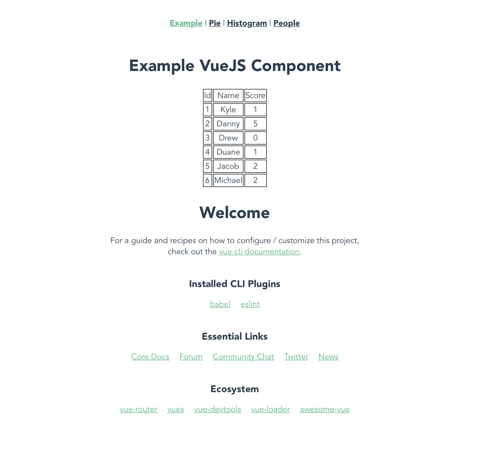
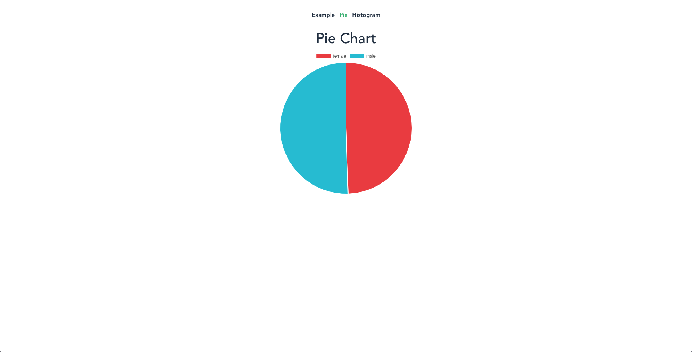

# Full Stack Interview Packet
Expected Completion time (4-8 hours).  Please read this page entirety before you begin.

This is a partially completed project that is intended to be worked by candidates and then submitted back to BRD upon completion.  The project is a simple web application with a Node.js backend server and a Vue.js frontend single page application.  The project is partially implemented and can be used as a reference for completing the application.

## Steps to complete the project<a name="steps"></a>
Please follow the steps below to complete the project.    

1.  Download and unzip the project to your computer (or clone using git)
1.  Verify you can build and run the application, see [Prerequisites](#prereq)
1.  Add your changes to the application, see [Changes to be made by candidate](#candidatechanges)
1.  Submit your changes back to BRD, see [Submit changes back to BRD](#submitback)

## Prerequisites<a name="prereq"></a>
Please make sure you can build and run the application before making any changes.  You must have Node.js installed locally to run the application.
1.  If not already installed, install [Node.js and NPM](https://nodejs.org/en/)
1.  Open command/terminal window and install required node modules for the backend and frontend (replace "project" with location you unzipped/cloned project)  
    ```
    cd project
    npm install
    cd frontend/
    npm install
    ```
1.  Verify that you can run the application, see [Running the application](#runapp)

## Changes to be made by candidates<a name="candidatechanges"></a>
The following changes should be made by the candidate in order to complete the project.  

### Backend changes
The following changes should be made to the backend index.js file:  
 1. Load the provided data.csv into the database table people_data  
 1. Provide necessary API endpoints for querying the data as needed to support the frontend changes

### Frontend changes
The following changes should be made to the frontend (located under ./frontend):  
 1. Create a histogram of the ages of people contained in the dataset   
 1. Create a form to insert a new row into people_data through a POST call  
 1. Display all the people in a meaningful way (perhaps a table)  

**Add your own flair to the webpages**   
 Feel free to use any necessary libraries, be prepared to explain your choices


## Running the application<a name="runapp"></a>
Do the following to startup the application and make it accessible from your browser:

1.  Open command/terminal window and run the backend [express](https://expressjs.com/) server
    ```
    cd project
    npm start
    ```
    You should see something like following once started.  Changes will automatically be recompiled and deployed:
    ```
    [nodemon] 1.18.10
    [nodemon] to restart at any time, enter `rs`
    [nodemon] watching: *.*
    [nodemon] starting `node index.js`
    Example app listening on port 3000!
    { id: 1, name: 'Kyle', score: 1 }
    { id: 2, name: 'Danny', score: 5 }
    { id: 3, name: 'Drew', score: 0 }
    { id: 4, name: 'Duane', score: 1 }
    { id: 5, name: 'Jacob', score: 2 }
    { id: 6, name: 'Michael', score: 2 }
    ```
1.  Open command/terminal window and run the frontend
    ```
    cd project
    cd frontend/
    npm run build -- --mode dev --watch
    ```
    You should see something like following once started.  Changes will automatically be recompiled.
    ```
     DONE  Compiled successfully in 2923ms                               10:28:24 AM
    
      File           Size                          Gzipped
    
      dist/app.js    4117.46 KiB                   862.24 KiB
    
      Images and other types of assets omitted.
    
     DONE  Build complete. Watching for changes...

    ```
The webapp should now be accessible at [http://localhost:3000](http://localhost:3000) and look something like following:


## Submit changes back to BRD<a name="submitback"></a>
Once you have completed all changes then do one of the following to make your changes available to us:
### GIT Repo
Upload entire project to your own git repo and then provide us with the link to your repo

### Zip File
Zip up the entire project and send it to us via email

**IMPORTANT**:  Do not include the ***"node_modules"*** directory when creating your git repo or zip.  This directory is automatically created when doing an "npm install" and will be very large.  This directory will exist in both ***project/*** and ***project/frontend*** so will need to be excluded from both locations.

## Helpful tips
Below is information to help you complete the project.

### Review the existing code
The project includes an already implemented sample API endpoint that accesses a database table to retrieve data and associated Vue.js component to display the data for your reference. 

### Suggestions for making changes
Feel free to structure your code however you wish.  You will likely want to utilize the Vue.js components in `frontend/src/views/` which have already been created.

### Examples

#### Pie Chart (already implemented)
The pie chart is already implemented and will look something like the following once you have loaded the data.csv file into the people_data table 


#### Histogram Chart (completed by candidate)
This is an example of what the histogram chart should look like once completed by the candidate.  Examine how the Pie Chart was implemented and research the library used to create it in order to create the histogram. 


#### SQL
We're going to be using [Sqlite3](https://www.npmjs.com/package/sqlite3) as our in memory relational database for this project. 
You're going to need to read in data from data.csv using whatever methods you'd like. 
Given is an example table that showcases the basic syntax for creating a table in Sqlite3. 
You're going to have to duplicate and modify this to store the data from data.csv.
```sql
CREATE TABLE `table_name` (
    column1 TEXT,
    column2 INT
);
```
To populate your table, you can accomplish this with two different methods.
```sql
INSERT INTO `table_name` ('column1', 'column2') VALUES (value1, value2);

INSERT INTO `table_name` VALUES (value1, value2); 

```
Note that your values MUST match the data type defined in your create. 
The second method is shorthand for inserting values in the order that they are defined (the number of values inserted must match the number of values defined).

To retrieve data from your table, you can use the following commands base on which attributes you want.
```sql
SELECT * FROM `table_name`;

SELECT column1, column2 FROM `table_name`;

#provides an alias for column1  
SELECT column1 as data FROM `table_name`;
```

#### Express
[Express](https://expressjs.com/) will the be the backend server that your frontend will interact with.
You can find the code for the express server inside index.js. 
Here we will be defining our [REST](https://en.wikipedia.org/wiki/Representational_state_transfer) server.
To create a GET endpoint use the following code:
```javascript
//access at url localhost:3000/sum?x=1&y=2
app.get('/sum', (req,res)=>{
    let x = req.query.x;
    let y = req.query.y;

    //some kind of computation
    let z = x + y;

    res.send('' + z)
});
```
To access the endpoints defined in your backend use the [fetch](https://developer.mozilla.org/en-US/docs/Web/API/Fetch_API) method.
```javascript
fetch('http://localhost:3000/sum?x=1&y=2').then(result=>{
    return res.json();
}).then(data => {
    //3
    console.log(data);
});
```

You may want to research Promise based/callback asynchronous calls if you do not understand the syntax. 
#### Vue
The file structure is organized into three folders: Views, Containers, and Components.
Views contain the page to be rendered by the router. This is where you should place your containers or components.
Containers are a wrapper around your components. They usually handle the fetching and sending of data. 
Components are parts to be rendered on the page, they should be reusable, flexible, and not dependent on the data passed in through props.  

Provided to you is the pie chart. The view will work once you populate the people_data table. 
Use this as a reference point when creating your histogram. The library being used is [vue-chartjs](https://vue-chartjs.org/), a vue wrapper for [chart.js](https://www.chartjs.org/)

You may find that you need to create N number of components base on the data in some list. 
Take a look at Example.vue if you get stuck.


